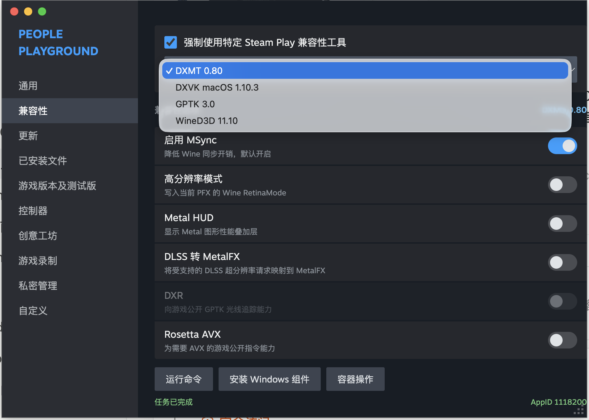

# RealSteamOnMac

[English](README.md)

通过 macOS 原生 Steam 库运行符合条件的 Windows-only 游戏，并可为每个游戏
单独选择 GPTK、DXMT、DXVK macOS 或 WineD3D。

> [!WARNING]
> 这是会修改特定 macOS Steam 构建的实验性软件。请保留安装器自动生成的回滚
> 备份。`0.1.2` 支持已验证的 Steam build `1780705203`、
> `1780965181` 和 `1781212412`。

## 主要功能

- 保留 Steam 原生库、下载、属性、开始游戏、Steamworks、创意工坊和
  AutoCloud 流程。
- 自动覆盖账户中所有可见且仅支持 Windows 的游戏。
- 原生或同时支持 macOS 的游戏继续使用 Steam 原始路径。
- 从
  `~/Library/Application Support/Steam/compatibilitytools.d/`
  发现可并存的多个兼容性工具版本。
- 每个游戏保存精确的工具 ID 和不可变运行时包。
- 在兼容性页面提供 Steam 风格的 MSync、Retina、Metal HUD、MetalFX、
  DXR 和 Rosetta AVX 控件，并根据工具能力自动禁用不支持的选项。
- 直接使用兼容性页面中的 Valve 原生控件运行命令、安装依赖、打开 C: 盘、
  配置 Wine、管理进程和可恢复地移除容器。
- 新容器默认为 Windows 10，并使用真正的 `WINEMSYNC=1`。
- 提供可回滚的安装/更新/卸载 PKG 和 Ed25519 签名更新清单。

## 界面预览

直接在 Steam 原有属性页面中选择独立安装的兼容性工具：



运行命令、安装 Windows 组件和容器操作直接在 Steam 原有兼容性选择器
下方展开，不挂载覆盖层或替代设置面板。

## 系统要求

- Apple Silicon Mac。
- macOS 14 Sonoma 或更高版本。
- 原生 macOS Steam，build `1780705203`、`1780965181` 或
  `1781212412`。
- 网络连接和大约 3 GB 可用空间。
- Apple Command Line Tools，包括 `/usr/bin/python3`。

需要内核级反作弊、Windows 驱动或不受支持 DRM 的游戏通常无法运行。

## 安装

1. 从 [Releases](https://github.com/dazi2011/RealSteamOnMac/releases)
   下载 `RealSteamOnMac-Install.pkg` 和 `SHA256SUMS`。
2. 校验安装包：

   ```bash
   shasum -a 256 -c SHA256SUMS
   ```

3. 可选 GPTK 支持：自行从 Apple 官方下载 Game Porting Toolkit 3.0，
   并将镜像放到
   `~/Downloads/Game_Porting_Toolkit_3.0.dmg`。
4. 打开安装包。安装器会停止 Steam、创建干净备份、安装运行时和兼容性
   工具，然后只对已验证的 Steam 构建应用补丁。

没有官方 GPTK 镜像时，仍会安装 DXMT 0.80、DXVK macOS 1.10.3 和
WineD3D 11.10。公开包不会重新分发 Apple D3DMetal。

由于目前没有 Developer ID Installer 证书，PKG 尚未签名或公证。macOS
可能要求在 **系统设置 > 隐私与安全性 > 仍要打开** 中确认。发布说明会明确
显示这一限制。

## 使用

打开 Windows-only 游戏的 **属性 > 兼容性**，勾选强制使用 Steam Play
兼容性工具，然后在 Steam 原生下拉菜单中选择工具。紧凑设置和操作会纵向
显示在下方。不同游戏可以选择不同工具和版本。

## 更新

已安装的更新器会验证发布清单签名、Steam build、文件大小和 SHA-256，
再打开独立的事务更新包 `RealSteamOnMac-Update.pkg`：

```bash
"$HOME/Library/Application Support/RealSteamOnMac/bin/check-for-updates" \
  --current-version "$(<"$HOME/Library/Application Support/RealSteamOnMac/VERSION")" \
  --steam-build 1781212412 \
  --public-key "$HOME/Library/Application Support/RealSteamOnMac/release-public-key.hex" \
  --verifier "$HOME/Library/Application Support/RealSteamOnMac/bin/verify-release-signature" \
  --install
```

未知 Steam build 会直接拒绝更新，直到发布对应兼容版本。
Update.pkg 会先快照 Steam 应用和项目可变文件，再安装并切换并存的新运行时；
任何步骤失败都会恢复旧安装。已下载游戏、PFX 容器、用户自行添加的兼容性
工具和每游戏配置不在替换范围内。
在两个受支持的 Steam build 之间切换时，需要先卸载 RealSteamOnMac，
让 Steam 完成更新，再重新安装。这样会为新构建生成匹配的干净回滚快照，
不会复用旧 Steam build 的备份。

## 卸载

下载并打开 `RealSteamOnMac-Uninstall.pkg`。它会停止 Steam、恢复记录的
干净快照、把未被修改的项目兼容性工具移动到
`~/RealSteamOnMac-Rollback`，并保留已下载游戏和 PFX 容器。

## 数据位置

| 数据 | 路径 |
|---|---|
| 兼容性工具 | `~/Library/Application Support/Steam/compatibilitytools.d/` |
| 运行时和设置 | `~/Library/Application Support/RealSteamOnMac/` |
| 游戏容器 | Steam 库 `steamapps/compatdata/<appid>/pfx/` |
| 安装备份 | `~/RealSteamOnMac-Backups/` |
| 回滚材料 | `~/RealSteamOnMac-Rollback/` |
| 日志 | `~/Library/Logs/RealSteamOnMac/` |

## 已知问题

- Steam 更新可能改变二进制或 UI 哈希；未知构建会被拒绝。
- 在受支持的 Steam build 之间升级仍需执行卸载、Steam 更新、重新安装，
  以保证回滚备份与当前运行时一致。
- 游戏兼容性和性能取决于具体游戏与渲染器。
- 首次安装需要下载并展开较大的 Wine 运行时。
- GPTK 需要用户自行获得 Apple 官方镜像。
- 当前公开 PKG 未签名且未公证。

## 开发与验证

```bash
node --test tests/*.mjs
/usr/bin/python3 -m unittest discover -s tests -p 'test_*.py'
for test_file in tests/test_*.sh; do sh "$test_file"; done
script/build_release_pkgs.sh
```

接口和恢复约定见 [docs/interfaces.md](docs/interfaces.md)，工程历史见
[docs/project-history.md](docs/project-history.md)。

## 致谢与声明

感谢 Wine、Wine Staging、DXMT、DXVK、Proton 和 Gcenx macOS Wine
贡献者。准确版本、源码和许可证见
[THIRD_PARTY_NOTICES.md](THIRD_PARTY_NOTICES.md)。

RealSteamOnMac 是独立项目，与 Valve、Steam、Apple、CodeWeavers 或
Microsoft 无隶属、背书或官方支持关系。
