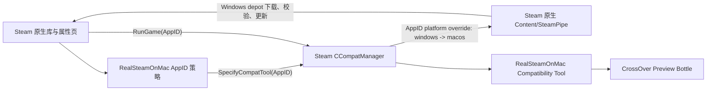

# Research Report: technical

**Date:** 2026-06-07
**Author:** wudazi
**Research Type:** technical

---

## Research Overview

本报告研究如何让一个原生 macOS Steam 客户端同时安全管理 macOS 原生游戏和需要 CrossOver 的 Windows 游戏，避免全局平台覆盖污染原生游戏的 depot、更新与启动状态。

---

## Technical Research Scope Confirmation

**Research Topic:** 在单一 macOS Steam 客户端中隔离 macOS 原生游戏与 Windows 游戏的安装和启动平台
**Research Goals:** 确认全局 Windows 平台覆盖对已安装和新安装 macOS 游戏的影响，并选出只对 Windows-only 游戏启用安装、Play 和兼容性页面的可靠方案

**Technical Research Scope:**

- Architecture Analysis - design patterns, frameworks, system architecture
- Implementation Approaches - development methodologies, coding patterns
- Technology Stack - languages, frameworks, tools, platforms
- Integration Patterns - APIs, protocols, interoperability
- Performance Considerations - scalability, optimization, patterns

**Research Methodology:**

- Current web data with rigorous source verification
- Multi-source validation for critical technical claims
- Confidence level framework for uncertain information
- Comprehensive technical coverage with architecture-specific insights

**Scope Confirmed:** 2026-06-07

## Technology Stack Analysis

### Programming Languages

本项目适合采用分层语言栈，而不是把 UI、Steam 注入和 CrossOver 控制全部塞进一个动态库。

- **C++17 / Objective-C++**：用于 macOS Steam 引导、动态库代理、进程跟踪和极少量必须贴近 Mach-O/AppKit 的工作。Millennium 当前 macOS legacy 安装会把原始 `libtier0_s.dylib` 备份为 `libtier0_s.real.dylib`，再用 `clang++` 构建同时包含 `arm64` 与 `x86_64` 的 re-export proxy。这个路径可以保留原版 `Steam.app` 作为用户入口，但属于会被 Steam 更新覆盖的实验性注入点。
- **TypeScript + React**：用于 Steam Chromium UI 中的“兼容性”页面、下拉菜单、警告、登录状态和依赖项界面。Millennium 插件前端可以访问 Steam 自身 React 环境和组件，适合保持原版视觉风格。
- **Lua**：用于 Millennium 插件的本机后端，承担配置读写、应用程序与 bottle 扫描、启动受控 helper，以及前后端 RPC。当前官方插件模板已将 Lua 作为新插件后端，Python 仅保留为旧插件兼容项。
- **Swift 或 C++ helper，后续二选一**：若 Lua 的进程监督、文件锁、Keychain 或事务回滚能力不足，再增加一个小型原生 helper。首版不应预先引入该层；只有下载/替换事务证明需要时再添加。

_Popular Languages: C++17、TypeScript/React、Lua_  
_Emerging Languages: Swift 仅作为可能的安全 helper，不作为首版必需项_  
_Language Evolution: Millennium 新插件后端已从兼容 Python 转向 Lua；前端继续使用 TypeScript/React_  
_Performance Characteristics: UI 与扫描工作适合 TypeScript/Lua；进程注入和 Mach-O 代理必须使用编译型原生代码_  
_Sources: https://github.com/SteamClientHomebrew/Millennium/tree/f604db217676a6eab243b724bc68bdce5dac7cbd , https://github.com/SteamClientHomebrew/PluginTemplate/tree/0870cc275d5fea167c0966f6a440f541c7f8306c , https://docs.steambrew.app/plugins/structure/file-structure_

### Development Frameworks and Libraries

- **Millennium** 是当前最合适的 Steam UI 注入框架。它提供 TypeScript/React 前端、Lua 后端、前后端调用、Steam 浏览器资源 patch，以及 macOS wrapper 和 legacy tier0 两种引导方式。
- **`@steambrew/client` / `@steambrew/api`** 用于复用 Steam 组件并与客户端对象交互。兼容性页面应尽量重用 Steam 现有的 App Properties 导航和控件，不复制一套外观相似但行为脱节的独立窗口。
- **RE2 资源变换** 是当前 Millennium 插件模板提供的前端插入机制。由于 Steam 的压缩 bundle 名称和符号会随更新变化，patch 必须采用“特征匹配 + 版本探测 + 失败时不注入”的策略，不能依赖固定偏移。
- **CrossOver Preview CLI** 是运行时提供商。本机 `27.0.0.40479` 的 `wine` 支持 `--bottle`、`--workdir`、`--env`、`--no-update`、`--no-gui`、`--wait-children`；`cxbottle` 支持按模板创建、复制、归档和查询 bottle。实际业务层应调用这些 CLI，而不是自动化 CrossOver GUI。

_Major Frameworks: Millennium、Steam React UI、CrossOver Preview CLI_  
_Micro-frameworks: Lua backend modules、RE2 transforms、本地原生 helper_  
_Evolution Trends: Millennium 的 macOS 支持仍属实验性；默认 wrapper 不修改 Steam 跟踪文件，legacy tier0 可保留原 `Steam.app` 入口但维护成本更高_  
_Ecosystem Maturity: Steam UI 注入层可用但易受客户端更新影响；CrossOver bottle/图形后端模型较成熟_  
_Sources: https://github.com/SteamClientHomebrew/Millennium , https://docs.steambrew.app/plugins/lua/millennium , https://docs.steambrew.app/plugins/structure/config , https://support.codeweavers.com/en_US/crossover-mac-user-guide_

### Database and Storage Technologies

本项目不需要关系数据库、NoSQL、内存数据库或数据仓库。引入数据库只会增加迁移和损坏面。

- **项目配置**：放在 `~/Library/Application Support/RealSteamOnMac/`，使用带 `schemaVersion` 的 JSON 文件，记录 AppID 到 provider、bottle、renderer、runtime package 的映射。凭据不得写入配置。
- **Steam 元数据**：读取 Steam 的 appinfo、library folders 和 app manifest，使用结构化 VDF/KeyValues 解析器。Valve 文档确认 depot 是按 OS、架构、语言等规则挂载的内容单元，manifest 则列出 depot 文件、大小和 SHA-1 元数据。因此不能把 `appmanifest_*.acf` 当成普通文本随意拼接。
- **运行方式包**：使用目录加 manifest 的不可变版本包，而不是直接把第三方图形库散落到 CrossOver 应用包。每个包需声明类型、版本、目标文件、哈希和兼容的 CrossOver 范围。
- **事务状态**：下载、组件替换和还原使用小型 journal 文件与原子 rename；崩溃后根据 journal 回滚。首阶段仅实现配置和扫描，不进行 CrossOver 组件替换。

_Relational Databases: 不需要_  
_NoSQL Databases: 不需要_  
_In-Memory Databases: 不需要；进程内缓存即可_  
_Data Warehousing: 不适用_  
_Sources: https://partner.steamgames.com/doc/store/application/depots , https://partner.steamgames.com/doc/store/application/builds_

### Development Tools and Platforms

- **构建**：CMake + Ninja/Make 构建 Millennium 原生部分；Apple Clang 构建 universal Mach-O proxy；Bun + Millennium TTC 构建插件前端。
- **静态检查**：`clang` warnings、TypeScript typecheck、Lua syntax check、JSON Schema 校验。
- **测试**：先对 UI patch、provider 扫描、bottle 扫描和配置 round-trip 做自动化测试；涉及 Steam/CrossOver 的端到端测试只允许使用 People Playground（AppID `1118200`）及其专用 bottle。
- **签名与回滚**：任何 Steam runtime 修改前都要在项目外建立完整、带哈希的干净备份。tier0 proxy 和必要 runtime 文件可 ad-hoc 签名，但每次 Steam 更新后必须先做版本探测，未知版本默认禁用。
- **内容下载候选**：Valve 的 SteamCMD 明确支持在当前主机之外选择目标平台，并可在单个命令进程中设置 `@sSteamCmdForcePlatformType windows`。这比让常驻 macOS Steam 全局进入 Windows 模式更适合作为按 AppID 的隔离下载器；但它对普通已购客户端游戏、Steam Guard 和登录缓存的稳定性尚未在本项目中验证，当前只能列为候选，不是既定结论。

_IDE and Editors: 任意；构建与验证必须能由仓库脚本复现_  
_Version Control: Git；研究结论、设计、脚本和哈希清单全部入库_  
_Build Systems: CMake、Apple Clang、Bun、Millennium TTC_  
_Testing Frameworks: 原生单元测试、TypeScript 测试、受控 PP 端到端脚本_  
_Sources: https://github.com/SteamClientHomebrew/Millennium , https://developer.valvesoftware.com/wiki/SteamCMD , https://partner.steamgames.com/doc/sdk/uploading_

### Cloud Infrastructure and Deployment

运行时应保持 **local-first**，不部署项目自有云服务。

- SteamPipe/CDN 仅作为 Valve 官方内容来源。
- CrossOver 的在线 recipe/更新服务由 CodeWeavers 管理，本项目不复制其服务。
- 插件、helper 和 runtime manifest 可以通过 GitHub Releases 分发，但下载后必须校验固定哈希和签名。
- 用户的 Steam 登录凭据、Steam Guard 验证码、bottle 数据和游戏配置不得上传到项目服务器。
- 将来若需要更新检查，也应只获取无身份信息的版本 manifest；首版不需要常驻网络服务、容器平台、serverless 或 CDN。

_Major Cloud Providers: 不使用_  
_Container Technologies: 不使用 Docker/Kubernetes；CrossOver bottle 是本机 Wine 环境，不是 OCI 容器_  
_Serverless Platforms: 不使用_  
_CDN and Edge Computing: 仅依赖 Valve/CodeWeavers/GitHub 已有分发设施_  
_Sources: https://partner.steamgames.com/doc/sdk/uploading , https://support.codeweavers.com/en_US/crossover-mac-user-guide_

### Technology Adoption Trends

1. **全局平台覆盖应退出主架构。** Valve 文档说明 depot 依据 OS 条件挂载；Kaon 的实际实现进一步记录了全局 Windows 覆盖的结果：仅 macOS 游戏不会继续正常更新，双平台游戏会逐步被替换为 Windows 内容。该方法可用于短期实验，不适合作为混合游戏库的长期状态。
2. **Windows 内容下载应变成隔离任务。** 原生 Steam 始终保持 `macos`；Windows-only AppID 的安装/更新由独立进程临时选择 Windows 平台，并写入专用 library root。这样平台选择的生命周期限制在一个任务，而不是整个客户端会话。
3. **安装状态和 UI 状态必须解耦。** Millennium 只负责让 Windows-only 游戏出现自定义 Install/Play/Compatibility 行为；不能仅把按钮改绿后继续调用未经验证的原生 macOS 安装链。
4. **CrossOver 提供商必须按路径和版本识别。** CrossOver 与 CrossOver Preview 可能使用相同 bundle identifier，不能只靠 bundle ID 区分。
5. **SteamWorks 完整性仍是独立难题。** Valve 的 DRM 文档明确指出，部分游戏依赖已登录 Steam 客户端来验证所有权并启用 Steamworks。独立下载成功不等于游戏可以脱离 Windows Steam 运行；后台 Steam 或 macOS-aware `lsteamclient` 仍需后续研究。

_Migration Patterns: 从全局 `steam_dev.cfg` 转向 per-AppID、per-process 平台任务_  
_Emerging Technologies: Millennium macOS 注入、CrossOver DXMT/D3DMetal、可版本化 runtime package_  
_Legacy Technology: 永久全局 Windows 平台覆盖、直接改二进制固定偏移、明文命令行密码_  
_Community Trends: Kaon 证明需求和基础可行性；Millennium 提供了更可维护的 UI/后端插件框架_  
_Sources: https://github.com/natbro/kaon/tree/2c5f864df3a1686cff3ca994f433e4b1d96e1a82 , https://developer.valvesoftware.com/wiki/SteamCMD , https://partner.steamgames.com/doc/store/application/depots , https://partner.steamgames.com/doc/features/drm , https://github.com/SteamClientHomebrew/Millennium_

### Current Confidence and Research Gaps

- **高置信度**：常驻全局 Windows 模式会破坏混合平台库的正常 depot 选择与更新语义，因此不能作为最终方案。
- **高置信度**：People Playground 当前 appinfo 的 `oslist` 与 launch 配置均为 `windows`，适合作为 Windows-only UI 条件和受控测试目标。
- **高置信度**：Millennium + TypeScript/React + Lua 能承载兼容性页面、扫描和配置持久化；CrossOver Preview CLI 能按 bottle 启动和管理环境。
- **中等置信度**：SteamCMD 或隔离的 Steam content runtime 可以完成普通已购 Windows 游戏的 per-AppID 下载。Valve 文档证明跨平台选择能力，但尚未证明 AppID `1118200` 的登录、授权、manifest 和更新行为。
- **低置信度/待实验**：Windows 游戏能否在不显示 Windows Steam 窗口的同时完整获得 Steamworks。此前直接启动 People Playground 已出现 `SteamApi_Init failed with NoSteamClient`，因此不能把“直接运行 EXE”当成完成方案。

## Integration Patterns Analysis

### API Design Patterns

本项目不需要公网 REST、GraphQL 或 gRPC API。它需要的是一个严格分层的本机控制 API：

```text
Steam React UI
  -> RealSteamOnMac frontend controller
  -> Millennium callable RPC
  -> Lua validation/config backend
  -> native job helper
  -> Steam content provider / CrossOver Preview
```

前端只发送语义命令，例如：

- `get_app_state(appid)`
- `start_install(appid)`
- `cancel_install(appid)`
- `start_game(appid)`
- `stop_game(appid)`
- `get_compatibility_config(appid)`
- `save_compatibility_config(appid, config)`
- `scan_providers()`
- `scan_bottles(provider_id)`

前端不得发送任意 shell 命令、任意目标文件或任意 DLL 替换路径。Lua 后端负责 schema 校验和授权检查，native helper 再对路径做 canonicalization、允许目录检查和事务锁定。

_RESTful APIs: 不需要公网 REST；helper 若采用 loopback HTTP，只实现私有、版本化的本机 JSON API_  
_GraphQL APIs: 不适用_  
_RPC and gRPC: Millennium `callable` 是 UI 与 Lua 后端的首选 RPC；不引入 gRPC_  
_Webhook Patterns: 不使用外部 webhook；内部状态变化采用轮询或受控 frontend callback_  
_Sources: https://docs.steambrew.app/plugins/structure/file-structure , https://docs.steambrew.app/plugins/ts/browser/src/type-aliases/Millennium , https://docs.steambrew.app/plugins/lua/millennium_

### Steam UI Action Interception

对本机 Steam build 的只读分析确认，灰色按钮不是纯 CSS 状态：

- 当前 Steam UI 的动作解析函数根据 `selected_per_client_data.display_status` 决定 Install、Play、Pause 等动作。
- `InvalidPlatform` 当前被直接映射为 `null`，因此 Windows-only 游戏没有可执行动作。
- Install 动作随后映射到 `SteamClient.Installs.OpenInstallWizard([appid])`。
- Play 动作随后映射到 `SteamClient.Apps.RunGame(...)`。
- Play Bar 的状态区域单独把 `InvalidPlatform` 渲染为“适用于其他平台”及平台图标。

因此需要同时 patch 三个行为点，而不是只改颜色：

1. **动作解析器**：若 AppID 是受管的 Windows-only 游戏，根据 RealSteamOnMac 状态返回现有的 Download、Play、Pause 或 Stop 动作类型；其他游戏返回 Steam 原结果。
2. **动作执行器**：若 AppID 受管，Install/Play/Stop 转发到 RealSteamOnMac controller；其他游戏继续调用 Steam 原 API。
3. **Play Bar 状态/进度**：受管 AppID 显示自己的安装进度、错误、运行状态和重试动作，不显示原生 `InvalidPlatform`。

右键属性页使用同一条件插入自定义 Compatibility 项：`vecPlatforms` 包含 `windows` 且不包含 `osx`。这比使用 `is_invalid_os_type` 更可靠，因为后者也可能表示旧 32 位 macOS 游戏，而不是 Windows-only 游戏。

首版不修改 `AppOverview` protobuf、不伪造 `appmanifest_*.acf`、不把全局 `PLATFORM` 改成 Windows。Steam 自己仍认为该游戏不适用于当前平台，但用户可见的主动作由插件安全接管。

**本机证据：**

- Steam UI build：`1780352834`
- `library.js` SHA-256：`64eccb1338be23fea4fd3f01ce709d9d6e74f2c0eb1174bb0ab590202773badd`
- `chunk~2dcc5aaf7.js` SHA-256：`3b5616dfb905a92b1529796f43d28c49e362b137b8dfc92ec8ee5719715d2938`
- Millennium SDK 类型声明公开了 `OpenInstallWizard`、`RunGame`、`RegisterForAppDetails`、`RegisterForAppOverviewChanges` 和游戏动作订阅接口。

_Sources: https://github.com/SteamClientHomebrew/Millennium/tree/f604db217676a6eab243b724bc68bdce5dac7cbd/src/typescript/sdk/packages/client/src/globals/steam-client , https://github.com/SteamClientHomebrew/PluginTemplate/tree/0870cc275d5fea167c0966f6a440f541c7f8306c_

### Communication Protocols

- **Steam frontend -> Lua backend**：Millennium `callable` RPC，JSON-compatible 参数和返回值。
- **Lua backend -> frontend**：短操作直接返回；长任务可以通过 `millennium.call_frontend_method` 发送 JSON 状态字符串，但需要验证回调在 macOS 当前构建中的稳定性。
- **Lua backend -> native helper**：推荐 Unix domain socket；若 Millennium Lua 环境没有可用 UDS 客户端，则采用绑定 `127.0.0.1` 的随机高端口 HTTP/1.1，加每次启动随机 bearer token。不得监听外部网卡。
- **native helper -> CrossOver**：使用 argv 数组直接执行 CrossOver Preview 的 `wine`、`cxbottle` 等工具，禁止经过 shell 拼接。已在本机验证 `wine` 支持 `--bottle`、`--workdir`、`--env`、`--no-update`、`--no-gui`、`--wait-children`。
- **native helper -> Steam content provider**：通过 provider adapter 隔离。UI 与配置层不能依赖 SteamCMD、Windows Steam 或未来的 client hook 具体实现。

_HTTP/HTTPS Protocols: 仅作为无 UDS 能力时的 loopback fallback_  
_WebSocket Protocols: 首版不需要；安装进度每 500-1000ms 查询一次足够_  
_Message Queue Protocols: 不使用 AMQP/MQTT/Kafka_  
_gRPC and Protocol Buffers: 不在项目内部引入；Steam 自身 AppOverview 仍为 protobuf 数据_  
_Sources: https://docs.steambrew.app/plugins/lua/millennium , https://docs.steambrew.app/plugins/lua/http , https://github.com/SteamClientHomebrew/Millennium_

### Data Formats and Standards

所有跨层请求使用带版本号的 JSON：

```json
{
  "schemaVersion": 1,
  "requestId": "uuid",
  "operation": "install",
  "appId": 1118200,
  "providerId": "crossover-preview:/Applications/CrossOver Preview.app",
  "bottleId": "People Playground"
}
```

任务状态至少包含：

```text
unmanaged
needs_configuration
ready_to_install
installing
installed
update_available
launching
running
stopping
failed
```

每个状态包含 `revision`、`updatedAt`、可选 `progress`、可选 `errorCode`，前端只接受 revision 更高的更新，避免旧轮询覆盖新状态。错误使用稳定代码，例如 `PROVIDER_NOT_FOUND`、`AUTH_REQUIRED`、`WINDOW_VISIBILITY_VIOLATION`，显示文案由前端本地化。

_JSON and XML: JSON 用于配置、RPC、任务状态和 runtime manifest；不使用 XML_  
_Protobuf and MessagePack: 只读取 Steam 已有 protobuf，不自行扩展_  
_CSV and Flat Files: 不使用 CSV；journal 和事件日志可使用 newline-delimited JSON_  
_Custom Data Formats: Steam VDF/KeyValues 必须使用结构化 parser_  
_Sources: https://partner.steamgames.com/doc/store/application/depots , https://github.com/SteamClientHomebrew/Millennium_

### System Interoperability Approaches

#### UI Adapter

Millennium patch 只承担以下职责：

- 识别 Windows-only AppID。
- 向 App Properties 插入 Compatibility 页面。
- 将受管 AppID 的 action resolver 接到自定义 controller。
- 将 Play Bar 状态接到自定义状态 store。
- Steam build 或 patch 签名不匹配时 fail closed，恢复原始灰色状态。

不能让 patch 直接操作 bottle、下载游戏或替换图形组件。

#### Content Provider Adapter

定义统一接口：

```text
probe()
authenticate()
install(appid, target)
update(appid, target)
validate(appid, target)
cancel(jobid)
query(jobid)
```

候选实现与排序：

1. **隔离 SteamCMD provider，实验优先**：Valve 官方支持在单个 SteamCMD 进程里选择 Windows 平台。优点是不会改变图形 Steam 客户端的全局平台；缺点是 Valve 文档同时警告同一账号不能同时登录图形客户端和 SteamCMD，Steam Guard 和普通商业游戏授权也需实测。因此不能未经验证就作为默认后端。
2. **CrossOver Windows Steam provider，产品候选**：如果能在专用 bottle 中保持登录，并证明 `-silent` 状态下没有任何可见 Steam 窗口，它同时解决下载、授权和 Steamworks。此前本机测试因登录缓存无效弹出了登录窗口，因此目前不满足要求。
3. **原生 Steam per-AppID content hook，长期研究项**：在底层只为指定 AppID 改写 depot 平台选择，理论体验最佳，但需逆向未公开的 content system 调用链，Steam 更新风险最高。不能与首版 UI 同时押注。

下载 provider 必须写入 RealSteamOnMac 专用 Windows library root，并由自己的 manifest 管理。原生 Steam 不获得该路径的更新所有权，避免 macOS depot updater 清理 Windows 文件。

#### Launch Provider Adapter

```text
prepare_runtime()
ensure_steamworks_backend()
launch(appid, executable, args)
query_process_tree()
stop()
restore_runtime()
```

启动步骤应为：校验配置 -> 获取 AppID 锁 -> 准备 renderer/runtime -> 启动或确认后台 Steamworks backend -> 验证没有可见 Windows Steam 窗口 -> 启动游戏 -> 等待游戏进程树 -> 恢复 runtime -> 释放锁。

_Point-to-Point Integration: 每层通过稳定 adapter 接口连接_  
_API Gateway Patterns: 本机 helper 是受限命令网关_  
_Service Mesh: 不适用_  
_Enterprise Service Bus: 不适用_  
_Sources: https://developer.valvesoftware.com/wiki/SteamCMD , https://partner.steamgames.com/doc/features/drm , https://support.codeweavers.com/en_US/crossover-mac-user-guide_

### Microservices Integration Patterns

本项目不是微服务系统，但应借用少量可靠性模式：

- **Facade**：frontend controller 屏蔽 Steam UI patch 细节。
- **Adapter**：SteamCMD、CrossOver Windows Steam、未来 native hook 实现统一 content provider。
- **Circuit Breaker**：provider 连续失败、Steam build 未识别或检测到可见 Windows Steam 窗口后，自动禁用该 provider，按钮显示明确错误。
- **Saga/Compensating Transaction**：renderer 替换、启动和恢复构成一个本地事务；任何步骤失败都执行 restore。
- **Single Writer**：同一 provider 或 CrossOver app 的共享图形组件同一时间只允许一个修改任务。

_API Gateway Pattern: native helper 作为受限本机网关_  
_Service Discovery: 扫描 `/Applications`、`~/Applications` 和用户手选路径_  
_Circuit Breaker Pattern: build/provider/window invariant 失败时自动熔断_  
_Saga Pattern: runtime prepare/launch/restore 使用补偿事务_  
_Sources: https://support.codeweavers.com/en_US/crossover-mac-user-guide , https://github.com/SteamClientHomebrew/Millennium_

### Event-Driven Integration

无需消息中间件。采用“持久状态 + 小事件流”：

1. helper 为每个 job 写原子状态快照。
2. frontend 通过 Lua RPC 轮询活动 job；Steam 窗口隐藏或恢复时仍可重建状态。
3. 若 `call_frontend_method` 经验证稳定，可用于即时提示，但状态快照仍是事实来源。
4. helper 崩溃后，下一次启动读取 journal，将 `installing/launching/stopping` 转成 `failed_recoverable` 并执行清理。

_Publish-Subscribe Patterns: 可选 frontend callback，仅用于加速刷新_  
_Event Sourcing: 不做完整 event sourcing；保留有限审计日志_  
_Message Broker Patterns: 不使用_  
_CQRS Patterns: 命令与状态查询分离，但不引入额外框架_  
_Sources: https://docs.steambrew.app/plugins/lua/millennium , https://docs.steambrew.app/plugins/structure/file-structure_

### Integration Security Patterns

- 任何账号密码、Steam Guard code 都不得放入命令行、日志或项目 JSON。
- SteamCMD 官方文档建议交互式输入密码，并指出同一账号不能同时登录图形客户端和 SteamCMD。这一限制必须视为架构风险，而不是测试小问题。
- loopback helper 使用随机 token、0600 权限状态目录、请求 nonce 和 AppID allowlist。
- provider/bottle/runtime 路径全部 canonicalize；拒绝符号链接逃逸和不在允许根目录内的写入目标。
- runtime package 必须校验 manifest、文件哈希、目标 CrossOver 版本和预期备份哈希。
- 前端传来的所有数据均不可信。Millennium 文档明确说明 backend/frontend 调用不会自动做类型检查。
- 检测到 Windows Steam 可见窗口时，启动任务必须失败并回滚，不能把窗口隐藏失败当作普通警告。

_OAuth 2.0 and JWT: 不适用_  
_API Key Management: loopback token 每次 helper 启动轮换_  
_Mutual TLS: 本机 UDS 不需要；loopback HTTP 也不引入证书复杂度_  
_Data Encryption: 凭据后续若必须存储，只允许 macOS Keychain；首版不实现凭据存储_  
_Sources: https://developer.valvesoftware.com/wiki/SteamCMD , https://docs.steambrew.app/plugins/lua/millennium , https://partner.steamgames.com/doc/features/drm_

### Recommended Integration Decision

采用 **UI-first、provider-pluggable** 的路线：

1. 首先实现 Windows-only 判定、Compatibility 页面、受管 AppID action resolver 和 Play Bar 自定义状态。
2. 使用模拟 provider 验证灰色 Install 能变成可点击下载按钮，模拟安装完成后能切换成绿色 Play，点击事件不会进入 Steam 原生 Windows 失败链。
3. 再用 People Playground 测试 SteamCMD provider。若无法与原生 Steam 登录共存，立即降级为研究工具，不把用户账号登出作为产品流程。
4. 随后修复并测试 CrossOver Preview 专用 bottle 的 Windows Steam 登录与 `-silent` 行为；只有连续证明没有可见 Steam 窗口，才允许作为启动 backend。
5. 若两个 provider 都不能满足约束，再研究原生 Steam per-AppID content hook；不回退到永久全局 Windows 模式。

这条路线可以在下载后端尚未最终选定时，先完成用户明确要求的按钮和兼容性 UI，同时保持 macOS 游戏零行为变化。

## Architectural Patterns and Design

### Native Steam Compatibility Evidence

本阶段的新证据改变了 provider 的优先级。**原生 macOS Steam 的按 AppID 兼容层并非只有前端残留；当前二进制包含完整的兼容工具注册、平台覆盖、安装任务和缓存状态机。** 因此，第一优先方案应改为激活原生 `CompatManager`，让 Steam 自己完成授权、depot 解析、下载、校验、更新和进度展示。

当前本机样本：

- Steam UI build ID：`1780352834`
- `steamclient.dylib`：universal `x86_64 + arm64`，SHA-256 `5057ecc68875dcdd8c169c86472b3ab14772ef34faf234c0bd2e798acf3cfbe8`
- Steam UI chunk：SHA-256 `3b5616dfb905a92b1529796f43d28c49e362b137b8dfc92ec8ee5719715d2938`
- 样本时间：`steamclient.dylib` 修改时间为 2026-06-02

本机 `steamclient.dylib` 中已确认存在：

- `CCompatManager`
- `CRegisterCompatToolJob`
- `CLoadCompatibilityToolManifestJob`
- `CLoadLocalCompatibilityToolManifestJob`
- `CCallInstallAppJob`
- `CCacheOffSingleAppSteamPlayStateJob`
- `CSpecifyAppCompatToolJob`
- `CCompatManager::InternalSpecifyCompatTool`
- `CCompatManager::YldRegisterTool`
- `CCompatManager::GetAppPlatformOverride`
- `CCompatManager::SetAppPlatformOverride`
- `CCompatManager::YldCheckIfAppNeedsPlatformCompatibility`
- `m_mapAppPlatformOverride`
- `platform_overrides`
- `compat.vdf`
- `from_oslist`、`to_oslist`
- `STEAM_EXTRA_COMPAT_TOOLS_PATHS`
- `/compatibilitytools.d`

只读反汇编还确认：

1. `YldRegisterTool` 会把兼容工具的目标平台与当前客户端平台比较；该逻辑是字符串驱动的通用判断，并非硬编码只接受 Linux。
2. `YldCheckIfAppNeedsPlatformCompatibility` 逐 AppID 查询是否需要平台兼容，并调用平台覆盖写入路径。
3. 平台覆盖保存的是 AppID 对应的 source/destination 平台，而不是改变整个客户端的全局平台。
4. Steam UI 已包含 `GetAvailableCompatTools(appid)` 和 `SpecifyCompatTool(appid, tool)`；属性页只是被 `PLATFORM == "linux"` 的前端条件隐藏。

Valve 的公开实现也证明兼容工具清单本来就用 `from_oslist` 和 `to_oslist` 描述平台转换。Proton 的官方模板是 `windows -> linux`；本项目需要实验 `windows -> macos`。Valve 同时说明，Steam Play 可以让客户端直接安装和运行本机不原生支持的平台游戏，且本地兼容工具可以注册到 `compatibilitytools.d`。

**证据等级：**

- “macOS 二进制包含完整 CompatManager 与按 AppID 平台覆盖”：高置信度。
- “`windows -> macos` 工具能被当前版本注册”：中高置信度，仍需运行时实验。
- “只解除兼容层门槛后，原生 Install 会自动选择 Windows depot”：中等置信度，是下一阶段最关键的验证项。
- “原生 Play 能直接把启动交给 CrossOver wrapper”：中等置信度，需在下载链路验证后单独测试。

_Sources: https://github.com/ValveSoftware/Proton , https://raw.githubusercontent.com/ValveSoftware/Proton/proton_11.0/compatibilitytool.vdf.template , https://raw.githubusercontent.com/ValveSoftware/Proton/proton_11.0/toolmanifest_x86_64.vdf , https://steamcommunity.com/app/221410/allnews/ , https://partner.steamgames.com/doc/store/application/depots_

### System Architecture Patterns

推荐采用 **native data plane + injected control plane**：



各层职责：

1. **UI Injection Layer**：只显示 Compatibility 页面、允许用户启用某个 AppID，并展示原生安装/运行状态。
2. **Policy Layer**：保存允许使用 Windows depot 的 AppID allowlist，以及该 AppID 的 provider、bottle 和 renderer 选择。
3. **Native Compat Bridge**：注册 `windows -> macos` 兼容工具，调用 Steam 已有的 `SpecifyCompatTool`，必要时只钩住兼容层启用门槛。
4. **Native Content Plane**：继续使用 Steam 原生 `OpenInstallWizard`、appmanifest、下载队列、校验、补丁、授权和进度。
5. **Runtime Tool Layer**：只在启动阶段将 Steam 提供的命令、环境和 AppID 转交给 CrossOver；不下载游戏，不实现 Steam 协议。

此结构保证 macOS 原生游戏从不进入 RealSteamOnMac 的平台覆盖表。全局 `@sSteamCmdForcePlatformType windows` 不进入产品架构，只可作为隔离实验的对照组。

### Design Principles and Best Practices

- **按 AppID opt-in**：默认所有游戏保持原始 macOS 行为。只有用户明确启用且被识别为 Windows-only 的 AppID 才调用 `SpecifyCompatTool`。
- **原生状态优先**：按钮是否变绿必须来自 Steam 后端状态从 `InvalidPlatform` 转为 `ReadyToInstall` 或 `ReadyToLaunch`，不能只改 CSS 或 action resolver。
- **最小钩子**：优先调用现有 SteamClient API；其次钩 `BIsCompatLayerEnabled` 一类单一门槛；最后才考虑直接干预 `SetAppPlatformOverride`。
- **禁止全局平台伪装**：不能钩通用 `GetCurrentPlatform` 让整个进程报告 Windows。异步下载任务会使线程局部伪装失效，也会污染原生 macOS 游戏。
- **fail closed**：Steam build、函数特征、兼容工具 schema 或状态转换不符合预期时，不点亮按钮，不发起下载。
- **可逆配置**：禁用某 AppID 时调用 `SpecifyCompatTool(appid, "")`，清除项目策略；不得删除游戏文件或 appmanifest。
- **下载与运行解耦**：先证明 Windows depot 可由原生 Steam完整安装和校验，再接 CrossOver 启动。两个问题不能一次性调试。

### Scalability and Performance Patterns

- Steam 已有 content scheduler、增量 patch、下载缓存和并发队列，应全部复用；自定义层不复制大文件，也不计算第二套完整校验索引。
- AppID 策略使用哈希映射，查询为常数时间；属性页只读取当前 AppID，不遍历整个库。
- 本地兼容工具和 CrossOver provider 扫描在 Steam 启动后执行一次，并以路径、版本和 mtime 为 key 缓存。
- Steam build 指纹只在启动时计算一次；运行时使用已验证的 feature signature，不反复扫描整个二进制。
- 每个 AppID 的兼容状态变化由 Steam callback/store 驱动；不高频轮询所有游戏。
- 启动阶段允许每个 bottle 并发一个任务；如果不同游戏共享同一个 CrossOver runtime 组件目录，则使用 provider 级写锁。

### Integration and Communication Patterns

#### Preferred Native Path

1. 在独立的 RealSteamOnMac 数据目录创建兼容工具：

```text
compatibilitytools.d/
└── RealSteamOnMac/
    ├── compatibilitytool.vdf
    ├── toolmanifest.vdf
    └── run
```

2. `compatibilitytool.vdf` 的核心映射为：

```text
"from_oslist" "windows"
"to_oslist"   "macos"
```

3. UI 对单个 AppID 调用：

```text
SteamClient.Apps.SpecifyCompatTool(appid, "realsteamonmac")
```

4. 观察 Steam 后端是否写入该 AppID 的 platform override，并把显示状态从 `InvalidPlatform` 转为 `ReadyToInstall`。
5. 安装继续调用原生：

```text
SteamClient.Installs.OpenInstallWizard(appid)
```

6. 启动继续调用原生：

```text
SteamClient.Apps.RunGame(appid)
```

兼容工具的 `run` wrapper 再负责将 `%command%`、工作目录、AppID 和 Steam 环境转交给 CrossOver helper。

#### Hook Escalation Order

1. **零二进制钩子实验**：注册工具并直接调用 `GetAvailableCompatTools`/`SpecifyCompatTool`。
2. **仅前端门槛**：解除 Compatibility 属性页的 Linux-only 条件。
3. **兼容层启用门槛**：若 `bCompatEnabled` 在 macOS 恒为 false，动态钩 `BIsCompatLayerEnabled`，但仍由 AppID 映射决定哪些游戏启用。
4. **按 AppID manager 钩子**：若 `SpecifyCompatTool` 被拒绝，只在 allowlist AppID 的 `YldCheckIfAppNeedsPlatformCompatibility` 路径注入 source/destination override。
5. **自定义 content provider**：只有原生 Steam content plane 经实验证明无法接受 macOS 目标兼容工具时才启用。

不允许跳到“全局返回 Windows”或永久写入 `@sSteamCmdForcePlatformType windows`。

#### Button Control

“控制哪些游戏可以下载/开始游戏”应由三层共同决定：

- **Eligibility**：`vecPlatforms` 包含 `windows` 且不包含 `osx`，并排除工具、DLC、服务器和不适合直接运行的 app type。
- **User policy**：AppID 在 RealSteamOnMac allowlist 中，且兼容工具、provider、bottle 配置完整。
- **Native readiness**：Steam 后端确认有许可证、可选择 Windows depot，并返回可安装或可启动状态。

只有三层都满足时才允许 Install/Play。UI 层可以显示“启用 Windows 兼容性”的入口，但不能伪造 native readiness。

### Security Architecture Patterns

- 原生 Steam 负责账号、许可证、Steam Guard、depot token 和内容完整性；RealSteamOnMac 不接触账号密码，也不记录登录凭据。
- compat wrapper 只接受 Steam 传入的 AppID 和经过 canonicalize 的游戏路径；AppID 必须位于 allowlist。
- wrapper 不允许任意 shell 字符串，所有 CrossOver 参数使用 argv 数组构造。
- 首版默认拒绝带内核级反作弊、未知 DRM 或多人竞技完整性要求的游戏，除非用户明确覆盖风险提示。
- 兼容工具目录、配置和 runtime package 记录 SHA-256；发现未授权变化时阻止启动。
- 钩子只能改变平台兼容资格，不能绕过购买、许可证、DRM、反作弊或地区限制。
- Steam 更新导致签名不匹配时自动停用钩子，原生 macOS 游戏继续保持原行为。

**法律与合同边界：** 使用 Steam 原生下载链可以降低重新实现私有协议、复制授权逻辑和分发游戏内容的风险，但不等于项目本身获得 Valve 授权。2026-04-20 修订的 Steam Subscriber Agreement 明确限制未经书面同意的 reverse engineering、modification、disassembly 和对 Steam 执行过程的 tampering，并保留适用法律另有允许时的例外。该风险必须在公开发布、商业化或大规模分发前由法律专业人士评估。本报告不是法律意见。

_Sources: https://store.steampowered.com/subscriber_agreement/index.html?l=english , https://partner.steamgames.com/doc/store/application/depots_

### Data Architecture Patterns

项目只保存控制面数据：

```json
{
  "schemaVersion": 1,
  "apps": {
    "1118200": {
      "enabled": true,
      "compatTool": "realsteamonmac",
      "provider": "crossover-preview",
      "bottle": "People Playground",
      "renderer": "default"
    }
  }
}
```

- Steam 自己拥有 `appmanifest_*.acf`、depot manifest、下载缓存和更新状态。
- RealSteamOnMac 不创建第二份“已安装”事实来源，只保存用户策略和运行时选择。
- Steam 的 `compat.vdf`/platform override cache 视为原生派生状态；项目通过 API 写入，不直接手工拼接。
- 配置写入使用临时文件 + `fsync` + atomic rename。
- 每次策略变更记录审计事件：时间、AppID、旧配置、新配置、Steam build、结果代码；不记录凭据。
- Steam build 指纹、已验证符号特征和兼容工具 schema 单独存入 compatibility matrix，便于后续 AI 接手。

### Deployment and Operations Architecture

#### Build Compatibility

每个支持的 Steam build 必须记录：

- Steam UI build ID
- `steamclient.dylib` SHA-256
- UI chunk SHA-256 或稳定资源特征
- `BIsCompatLayerEnabled`/manager hook 的签名
- 已验证的 API 行为
- People Playground 安装、校验、更新、启动结果

未知 build 一律进入观察模式：Compatibility 页面可显示，但不能启用原生下载钩子。

#### Backup and Rollback

在任何 Steam 应用、dylib、资源或签名修改前：

1. 完整退出原生 Steam。
2. 对原始 Steam 应用和待修改文件创建带哈希的干净备份。
3. 备份保存在 Steam 更新目录之外。
4. 验证备份可恢复且签名状态与原件一致。
5. 优先使用运行时注入；只有无替代方案时才修改包内文件并临时重签名。
6. 回滚需清除注入启动项、恢复原文件、移除 RealSteamOnMac compat tool 映射，但不删除游戏库。

#### First Controlled Experiment

实验对象固定为 People Playground，AppID `1118200`：

1. 创建干净 Steam 备份，但不修改原件。
2. 注册最小 `windows -> macos` 假兼容工具，`run` 只记录参数并立即返回，不启动游戏。
3. 从 Steam JS 上下文读取 `GetAvailableCompatTools(1118200)`。
4. 调用 `SpecifyCompatTool(1118200, "realsteamonmac")`。
5. 检查 platform override cache、app overview 状态和安装向导是否转为 Windows depot 计划。
6. 只下载一个可取消的初始区段，确认 `appmanifest`、depot ID 和下载队列由原生 Steam生成。
7. 取消并执行 Steam 原生 validate，确认没有影响任意 macOS 原生 AppID。

**Go 条件：**

- 只有 `1118200` 从 `InvalidPlatform` 转为可安装。
- 原生 macOS 游戏状态、depot 和启动项无变化。
- 下载由原生 Steam 队列完成，许可证仍由当前 macOS 登录会话处理。
- 停用 compat tool 后状态可恢复。

**No-Go 条件：**

- 需要全局 Windows 平台。
- Steam 为其他 AppID 选择 Windows depot。
- `SpecifyCompatTool` 无法形成持久的 per-AppID override。
- 原生安装向导仍强制拒绝 Windows depot。
- 必须启动第二个可见 Windows Steam 窗口才能下载。

### Recommended Architecture Decision

将前一阶段的 provider 排序修正为：

1. **原生 Steam CompatManager provider，当前首选**：复用 Steam 原版下载、授权、校验和更新，按 AppID 控制 Windows depot。
2. **CrossOver Windows Steam provider，启动或下载回退**：只有能保证后台运行且无可见第二窗口时才可使用。
3. **隔离 SteamCMD provider，研究回退**：受账号并发登录和 Steam Guard 行为约束。
4. **自定义下载 provider，最后手段**：维护和合规成本最高，不作为默认方案。

当前最合理的实现目标不是“把灰色按钮涂绿”，而是：

> 让用户为指定 AppID 启用一个 `windows -> macos` compatibility tool，使原生 Steam 自己把该 AppID 视为需要平台兼容，并因此进入原生 Windows depot 安装和更新状态机。

这条路径若运行时验证成功，就同时满足单一 Steam 前端、按游戏控制、macOS 原生游戏零污染、最少下载逻辑重实现，以及不启动第二个 Windows Steam 窗口。

## Implementation Approaches and Technology Adoption

### Technology Adoption Strategies

采用分阶段、按 AppID 灰度和失败关闭策略，不进行一次性全局平台切换：

1. 建立 Steam、CrossOver Preview 和 People Playground 的只读基线。
2. 注册只记录参数、不启动游戏的最小 Compatibility Tool。
3. 仅对 AppID `1118200` 调用 `SpecifyCompatTool`。
4. 验证 Steam 原生安装向导是否选择 Windows depot。
5. 原生下载链验证成功后，再接入 CrossOver Preview 启动。
6. 最后才研究 DXMT、DXVK 等运行时包切换与依赖安装。

未知 Steam build、签名或资源特征不匹配、探针失败时，插件必须进入观察模式，不启用下载与启动干预。Valve 的 Proton 本地安装方式证明 Compatibility Tool 可以作为独立目录部署，并由 Steam 在重启后发现；本项目复用这一模式，但将平台映射实验性地改为 `windows -> macos`。

_Sources: https://github.com/ValveSoftware/Proton , https://raw.githubusercontent.com/ValveSoftware/Proton/proton_11.0/compatibilitytool.vdf.template_

### Development Workflows and Tooling

建议项目结构：

```text
compat-tool/       Compatibility Tool manifest 和启动包装器
plugin/frontend/   Steam React 兼容性页面
plugin/backend/    配置、provider 和 bottle 扫描
helper/            可选原生进程监督与事务 helper
tests/fixtures/    脱敏 VDF、appmanifest 和 CrossOver 配置样本
tools/             Steam 指纹、备份、恢复和诊断脚本
docs/              研究、ADR、实验日志和接手说明
```

- 首阶段使用 shell 与标准库脚本构造最小实验，避免提前引入复杂构建系统。
- UI 阶段使用 Millennium Plugin Template、TypeScript/React 和 Lua 后端。
- `frontend` 只负责 Steam UI 与用户交互；本机文件系统、CrossOver 扫描和进程操作放入 Lua 或原生 helper。
- Millennium 文档要求 Lua 后端尽快调用 `ready()`，耗时扫描应在 Steam 加载后异步执行。
- Steam build ID、关键二进制哈希、UI 资源特征和验证结果必须提交到 compatibility matrix。

_Sources: https://docs.steambrew.app/plugins/structure/file-structure , https://docs.steambrew.app/plugins/lua/millennium , https://github.com/SteamClientHomebrew/PluginTemplate_

### Testing and Quality Assurance

测试按风险分层：

- **静态测试**：VDF schema、JSON schema、路径规范化、参数转义、AppID allowlist、运行时包 manifest。
- **契约测试**：Compatibility Tool 的 `from_oslist/to_oslist`、tool commandline、CrossOver CLI 参数和 bottle 定位。
- **集成测试**：只允许 People Playground bottle 和 AppID `1118200`；禁止扫描后自动修改其他 bottle。
- **原生 Steam 回归测试**：选择至少一个已安装 macOS 原生游戏，记录并对比安装状态、depot、启动项和按钮状态。
- **故障测试**：未知 Steam build、Steam 更新、CrossOver 缺失、磁盘空间不足、进程强杀和事务中断。
- **真实下载测试**：只启动可取消的初始区段，检查 appmanifest、depot ID、下载队列与许可证来源后立即取消。

每个阶段先建立失败测试或可重复诊断探针，再增加最小实现。UI 视觉点亮不算成功；只有 Steam 后端状态从 `InvalidPlatform` 转入原生可安装或可启动状态才算通过。

_Sources: https://partner.steamgames.com/doc/store/application/depots , https://developer.apple.com/documentation/xcode/diagnosing-issues-using-crash-reports-and-device-logs_

### Deployment and Operations Practices

- CI 可在 GitHub Actions 的 Intel 与 ARM64 macOS runner 上执行静态构建、格式检查、单元测试和 universal binary 检查。
- 涉及 Steam 登录态、真实 depot、CrossOver 许可和 UI 的测试只在专用本机节点执行。
- 任何 Steam app、dylib 或签名修改前必须退出 Steam，创建完整备份并验证哈希与恢复流程。
- 更新带签名的代码文件时使用临时文件加原子 rename，避免原地修改触发代码签名缓存问题。
- 兼容工具、插件和 helper 独立版本化；未知 Steam build 默认停用内部 API 调用。
- 日志按实验 ID、Steam build、AppID、provider 和阶段组织，不记录凭据、验证码或完整用户路径。

_Sources: https://docs.github.com/en/actions/reference/runners/github-hosted-runners , https://developer.apple.com/documentation/security/updating-mac-software_

### Team Organization and Skills

首阶段由单一工程流即可完成，但职责必须保持边界：

- Steam 研究：CEF/React、SteamClient Apps API、VDF 和 SteamPipe 状态。
- macOS 原生：Mach-O、codesign、进程与文件事务。
- CrossOver/Wine：bottle、CLI、进程树、图形后端和依赖组件。
- 测试与发布：兼容矩阵、回滚演练、日志脱敏和许可证审查。

当进入公开发布阶段，应增加独立代码审查和法律/合同审查。客户端注入、Steam 内部 API 与第三方图形组件分发不能只由功能测试决定是否发布。

### Cost Optimization and Resource Management

- 复用 Steam 原生下载、更新、校验和授权，避免维护自定义 SteamPipe 客户端。
- 首版不复制 CrossOver bottle，也不自动替换大型图形运行时；实验使用现有 People Playground bottle。
- 静态测试放入托管 CI，真实 Steam/CrossOver 测试保留在单台受控 Mac。
- 按 Steam build 指纹缓存验证结论；只有指纹变化才重新执行高风险探针。
- 运行时包按内容哈希去重，用户配置只保存引用，不复制相同二进制。

### Risk Assessment and Mitigation

| 风险 | 影响 | 缓解 |
|---|---|---|
| `windows -> macos` 工具无法注册 | 原生下载路线失效 | 先用假工具验证；失败后再定位 `BIsCompatLayerEnabled` |
| 工具可注册但安装器拒绝 Windows depot | 按 AppID override 不完整 | 追踪 `YldCheckIfAppNeedsPlatformCompatibility`，只做单点运行时 hook |
| Steam 更新改变 API/UI | 崩溃或错误修改 | build 指纹、特征探针、未知版本失败关闭 |
| CrossOver 启动显示主窗口 | 破坏统一入口 | 使用 `--no-gui` 实测；失败则直接运行游戏 EXE 或改 provider |
| bottle 并发修改 | 环境损坏 | 每 bottle 锁、运行中禁止组件切换、事务 journal |
| Steam 密码或验证码泄露 | 账号风险 | 不保存、不通过命令行传递；优先完全复用 macOS Steam 会话 |
| 客户端逆向和分发风险 | 合同或法律风险 | 最小干预、不开源 Valve 代码、发布前专业审查 |

_Sources: https://www.codeweavers.com/support/docs/crossover-mac/index , https://store.steampowered.com/subscriber_agreement/index.html?l=english_

## Technical Research Recommendations

### Implementation Roadmap

1. **P0 - Safety baseline**：备份、哈希、签名、恢复脚本、Steam/CrossOver build 指纹。
2. **P1 - Native compat probe**：注册假 Compatibility Tool，仅对 `1118200` 测试发现和 override。
3. **P2 - Native depot validation**：验证 Windows depot 计划、可取消下载、校验和卸载恢复。
4. **P3 - Steam UI integration**：插入兼容性页面、provider/bottle 扫描和配置持久化。
5. **P4 - CrossOver launch**：无第二 Steam 窗口的 CLI 启动、参数透传和进程监督。
6. **P5 - Runtime management**：bottle 创建、依赖安装和版本化图形运行时事务。
7. **P6 - Distribution readiness**：兼容矩阵、自动失败关闭、打包、许可证与发布评估。

### Technology Stack Recommendations

- **Steam UI**：Millennium + TypeScript/React + `@steambrew/client`。
- **本机后端**：Lua；只有进程监督和事务能力不足时加入 Swift/C++ helper。
- **Compatibility Tool**：VDF manifest + 最小 POSIX wrapper。
- **CrossOver provider**：CrossOver Preview CLI `wine --bottle ... --cx-app ... --no-gui`。
- **持久化**：版本化 JSON、原子写入、无数据库。
- **测试**：标准库测试、静态 fixtures、本机受控集成测试。

### Skill Development Requirements

- VDF/KeyValues 与 Steam AppInfo/depot 选择机制。
- Chromium DevTools、Steam React 和 Millennium resource transform。
- Mach-O、代码签名、动态加载和 macOS 进程模型。
- Wine/CrossOver bottle、Windows 进程树和图形后端。
- 事务文件更新、故障注入、可恢复实验设计。

### Success Metrics and KPIs

- 只有 allowlist AppID `1118200` 从 `InvalidPlatform` 转为可安装。
- Windows 内容由原生 Steam 下载、更新和校验。
- macOS 原生游戏的 depot、安装状态和启动行为零变化。
- 启动 People Playground 时不出现第二个 Windows Steam 窗口。
- 禁用兼容工具后 AppID 状态和文件布局可恢复。
- 未知 Steam build 的内部干预启用率为零。
- 所有修改前均存在哈希验证通过的恢复点。

## 2026-06-07 Runtime Experiment Update

本节是当日后续实机实验的权威增量结论；它取代上文“原生 Steam
按 AppID 下载链尚未验证”的旧判断。

### Confirmed Native Install Path

Steam Public Beta build `1780705203` 中，People Playground 对应的内部
app 对象满足：

- `app + 0x08`：AppID `1118200`
- `app + 0x1c`：平台 flags
- bit `0x10`：`InvalidPlatform`
- vtable `+0x68`：平台 flags getter

SteamUI UUID 为 `BF95203F-385E-3AF0-82B6-AC509AE1224D`，getter 偏移为
`0x005EAC3C`。只清除 allowlist 对象的 `0x10` 后，原版
`OpenInstallWizard([1118200])` 返回：

```text
eInstallState = 7
eAppError = 0
rgApps[0].nAppID = 1118200
rgApps[0].lDiskSpaceRequiredBytes = 455945761
```

这证明 macOS Steam 已进入原版许可证、appinfo、磁盘空间和安装配置
状态机，不需要项目重写 SteamPipe 下载器。测试随后调用
`CancelInstall()`，状态变为 `16`；未调用 `ContinueInstall()`。

### Chosen Injection Model

2026-06-07 的短生命周期 worker 模型已被 2026-06-08 的持久化实现取代。
当前实现仍不修改 SteamUI 代码段，也不使用 LLDB 常驻附加：

1. `Steam.app` 的 universal launcher 由 LaunchServices 正常启动。
2. launcher 在每次启动前验证或重装已知哈希的 Steam UI 资源补丁。
3. launcher 给官方 runtime 设置进程级 hook 与 compatibility tool 路径。
4. runtime 主程序使用带最小 DYLD 权限的 ad-hoc 签名。
5. hook 跨过 Steam 最早的一次 self-exec，并在首次完整扫描后清除注入
   环境。
6. worker 在进程生命周期内每 `250 ms` 刷新已追踪对象，每 `15 s` 做一次
   完整扫描，只修改 allowlist AppID 数据。
7. SharedJSContext 仅在 backend details 为状态 `9` 时把 allowlist overview
   从状态 `14` 同步为 `9`。
8. UI 补丁通过 `SteamUIStore.WindowStore.SteamUIWindows` 访问真实窗口，
   只对匹配 AppID 的 Steam 原生 React action component 执行
   `forceUpdate()`。

LLDB 方案被否决，因为暂停主进程会让 `ipcserver` 断开；SteamClient
异步 API 随后超时。直接 patch getter text 的方案也因延迟 IPC 故障被
否决。数据修改版在正常 App 启动 20 秒后仍能成功调用
`GetCachedAppDetails(1118200)` 和安装向导 API。

### Safety And Rollback

- allowlist 仅有 AppID `1118200`。
- `CompatToolMapping` 没有 AppID `0` 全局项。
- 干净完整备份位于
  `/Users/wudazi/RealSteamOnMac-Backups/steam-1780705203-20260607T083704Z`。
- `script/restore_steam_from_backup.sh` 会保留被替换文件，再恢复
  `Steam.app`、runtime 主程序和原版 `steamclient.dylib`。
- Steam 更新后 UUID、偏移和签名全部视为未知，必须重新验证。

## 2026-06-08 Persistent Native UI Update

People Playground 的持久前台链路已完成实机验证：

- 冷启动后 `overview.display_status = 9`；
- backend `details.eDisplayStatus = 9`；
- 可见按钮 `pointer-events = auto`；
- 可见按钮使用 Steam 原生蓝色渐变
  `rgb(71, 191, 255) -> rgb(26, 68, 194)`；
- 离开详情页再返回仍保持蓝色；
- 运行超过 30 秒仍保持蓝色；
- 完全退出 Steam 并直接重启后仍自动恢复；
- UI patch 状态为 `version 3`、
  `mode shared-app-store-native-actions`、`lastError = null`。

真实点击前台按钮后，原生安装管理器返回：

```text
eInstallState = 7
currentAppID = 1118200
eAppError = 0
nDiskSpaceRequired = 455945761
```

随后调用 `CancelInstall()`，状态进入 `16`。项目中用于该验证的点击探针
不包含 `ContinueInstall`、`OpenInstallWizard`、`RunGame` 或
`SpecifyCompatTool` 调用。

关键新结论是：只修改 SharedJSContext 中的 app overview 数据不足以让
已经挂载的主窗口 React action component 重算样式。稳定做法是继续使用
Steam 的原生对象和按钮，同时通过 Steam 自己登记的 BrowserWindow
document 找到匹配 AppID 的 action component 并触发 React 重渲染。该
方案不硬编码 webpack module ID，因此比直接调用压缩 bundle 内部导出
更能抵抗小版本漂移。

## 2026-06-08 Native Compatibility Properties Update

方案 2 已在 Steam Public Beta build `1780705203` 上完成实机验证。

### 原生页面门槛

Steam 的属性页实现位于：

```text
steamui/chunk~2dcc5aaf7.js
webpack module 73291
clean SHA-256:
6d28c06fafb32f99c695f4bc4d1b8a8b8fb5bc1efc425f2a78abb8697af81349
```

模块内 `dt(e)` 构造属性页列表。快捷方式与普通游戏各有一处完全相同的
兼容性页注册门槛：

```text
(0,f.CI)() && o.push(...)
```

`f` 对应 module `72476`，`CI` 是 Linux 平台判断。项目没有把整个 macOS
客户端伪装为 Linux，而是守护式地把两处判断扩展为：

```text
Linux || __REALSTEAMONMAC_CONFIG__.appids.includes(appid)
```

因此原有 Linux 行为不变，macOS 上只有显式 allowlist AppID 会注册原版
`St` Compatibility component。未知 chunk 哈希、锚点数量不是精确两处、
备份不匹配或补丁不一致时均失败关闭。

### 原生选择与 macOS 详情状态

原生页面使用：

- `SteamClient.Apps.GetAvailableCompatTools(appid)`
- `SteamClient.Apps.SpecifyCompatTool(appid, tool)`
- `details.strCompatToolName`
- `details.nCompatToolPriority == 250`

实测原生 `SpecifyCompatTool` 会把映射永久写入 `config.vdf`，但 macOS 的
`appDetailsStore` 仍把工具名和优先级报告为空。这会导致属性窗口重开后
原版复选框视觉上恢复为未选中，即使后端映射已经存在。

最终实现保留 `SpecifyCompatTool` 作为唯一后端写入路径，并增加一个仅限
allowlist 的前端状态桥：

1. 选择写入 `__REALSTEAMONMAC_COMPAT_SELECTIONS_V1__` 本地存储；
2. Steam 启动时重新确认原生 per-AppID 映射；
3. 只对白名单详情对象镜像工具名、显示名和优先级 `250`；
4. 取消选择时恢复原始详情字段并调用原生取消映射；
5. 非白名单 AppID 直接调用未包装 API，页面也不会注册。

### 实机证据

People Playground (`1118200`)：

- 属性页显示 `兼容性`；
- 复选框 `aria-checked = true`；
- 下拉框显示 `RealSteamOnMac Experimental`；
- 详情工具名为 `realsteamonmac-experimental`；
- 优先级为 `250`；
- 取消后工具名为空、优先级为 `0`；
- 再启用后恢复；
- 完整退出并重启 Steam 后仍保持选中。

反向验证使用 No Man's Sky (`275850`)：属性页只显示原有 macOS 页面，
没有 `兼容性` 标签。随后重新验证 People Playground 蓝色安装按钮，
仍进入原生安装状态 `7`、错误码 `0`，取消后状态为 `16`。
